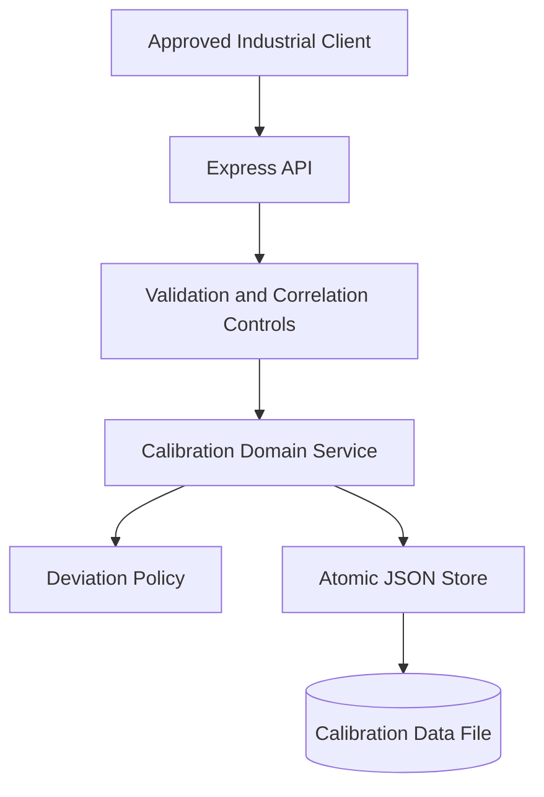
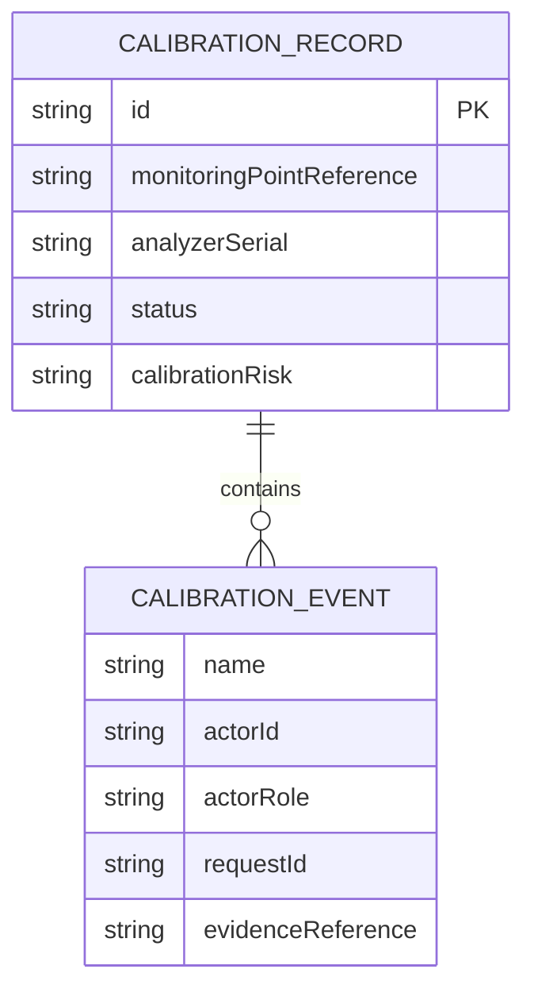
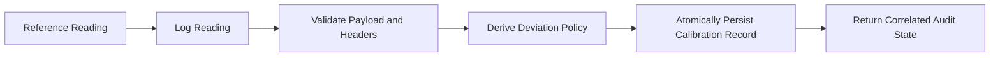
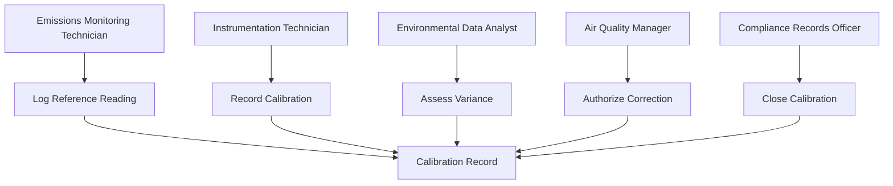
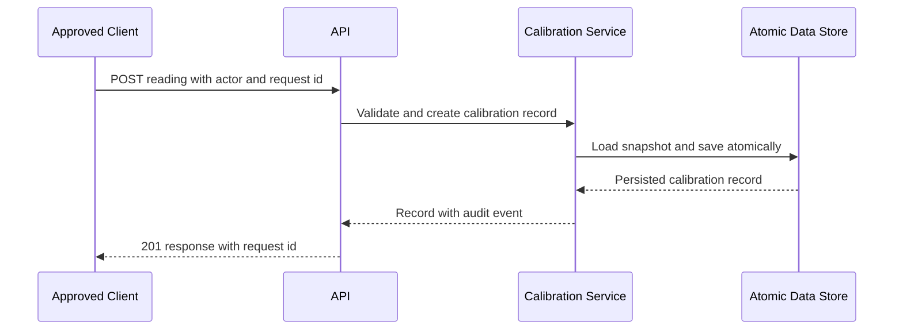

# Industrial Air Emissions Continuous Monitoring Calibration Assurance Service

## The Problem

Industrial facilities depend on continuous emissions monitoring systems to maintain defensible environmental data. When reference checks, calibration deviations, correction approvals, and closure evidence are scattered across informal records, it becomes difficult to demonstrate data integrity and accountable control of an out-of-tolerance instrument.

## The Solution

This service creates a controlled calibration record for each monitoring point and analyzer pair. It derives an operational risk classification from the reference deviation, enforces role-separated workflow stages, retains evidence for every action, rejects request replay, and persists complete state through an atomic write. The lifecycle moves forward from reference reading to controlled closure.

## Live Demo and Tech Stack

The public source repository is available at [GitHub](https://github.com/kholipha-ahmmad-al-amin/industrial-air-emissions-continuous-monitoring-calibration-assurance-service). A running instance exposes `GET /health` at `http://localhost:65092/health`.

| Layer | Technology | Responsibility |
| --- | --- | --- |
| Runtime | Node.js 22 | Runs the process and graceful signal handling. |
| HTTP API | Express 5 | Provides JSON endpoints and correlation middleware. |
| Domain controls | Native ESM modules | Enforces calibration policy and role-gated transitions. |
| Persistence | Atomic JSON file store | Persists records and globally consumed request identifiers. |
| Quality assurance | Vitest and Supertest | Validates service and HTTP behavior. |
| Automation | GitHub Actions | Runs installation, syntax checks, tests, and production audit. |

## Local Setup and Run Instructions

Use Node.js 22 or later. The following commands install the locked dependency set, verify the service, and run it on the default local network port.

```bash
git clone https://github.com/kholipha-ahmmad-al-amin/industrial-air-emissions-continuous-monitoring-calibration-assurance-service.git
cd industrial-air-emissions-continuous-monitoring-calibration-assurance-service
npm ci
npm run check
npm test
npm audit --omit=dev --audit-level=high
PORT=65092 npm start
```

Every mutation requires `x-actor-id`, `x-actor-role`, and a unique `x-request-id`.

```bash
curl -X POST http://127.0.0.1:65092/records \
  -H 'content-type: application/json' \
  -H 'x-actor-id: monitoring-001' \
  -H 'x-actor-role: emissions_monitoring_technician' \
  -H 'x-request-id: request-create-0001' \
  --data '{"monitoringPointReference":"STACK-01-CEMS","analyzerSerial":"CEMS-NOX-2026-042","pollutant":"Nitrogen Oxides","units":"ppm","observedValue":115,"referenceValue":100,"allowableDeviationPercent":5,"sourceEvidenceReference":"EVID-READING-2026-0042"}'
```

## System Documentation

### System Architecture Diagram



### Entity-Relationship Diagram



### Data Flow Diagram



### Use Case Diagram



### Sequence Diagram



## Owner

Created and maintained by Kholipha Ahmmad Al-Amin.

Software Engineer and AI Specialist

Founder and CEO of EquiSaaS BD

Principal Consultant at AR IT Consultancy

Full Stack Developer and SaaS Product Builder

Official links

Portfolio: https://kholipha-ahmmad-al-amin.equisaas-bd.com/

GitHub: https://github.com/kholipha-ahmmad-al-amin

LinkedIn: https://www.linkedin.com/in/kholipha-ahmmad-al-amin

X: https://x.com/al_amin5519

Facebook: https://www.facebook.com/kholipha.ahmmad.al.amin

Instagram: https://www.instagram.com/kholipha.ahmmad.al.amin

## Ownership

This project was created and is maintained by Kholipha Ahmmad Al-Amin.
